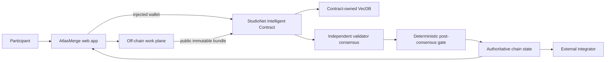

# AtlasMerge — Architecture

## 1. Architectural thesis

AtlasMerge turns public map observations into a canonical, versioned map-delta ledger. There is no hosted application backend or database: participants prepare public evidence in their browser or external public tooling. GenLayer is invoked when a bounded cluster is ready to become authoritative; validators fetch the evidence, inspect the existing feature and scoped prior deltas, then agree on the canonical mutation.

The architecture preserves one boundary:

> High-volume creation/observation happens off-chain; **a bounded canonical delta to a geographic feature: open/closed, name, access, direction, category, geometry-note or other supported attribute change** becomes authoritative only after a bounded GenLayer flow.

## 2. System context



Backend/service output is never the authoritative answer.

## 3. Components

### Web application

- domain workflow;
- public browsing;
- injected wallet;
- artifact preparation;
- live contract reads;
- transaction/finality rail;
- semantic-memory display;
- authoritative decision/history pages.

### Off-chain work plane

There is no hosted off-chain service or application database. High-volume observation, report drafting, geohash bucketing and bundle preparation occur in the browser or external public tooling selected by the participant. Only the bounded public immutable bundle URL and digest are submitted to GenLayer; canonical product state remains exclusively contract-owned.

### Intelligent Contract

Map layer registry; feature IDs and current canonical attributes; candidate delta clusters; evidence digests; semantic memory of accepted deltas; version history; decision receipts.

### Contract-owned semantic memory

Embed accepted deltas from a normalized sentence: geohash, feature type, canonical feature name, changed attribute, old value, new value and bounded reason. Retrieval is first deterministically filtered by layer and coarse geohash, then semantic KNN finds similar past changes. This avoids nearest-vector matches from distant places becoming misleading context.

## 4. Data ownership

| Data | Source of truth | Mutable | Consensus input |
|---|---|---:|---:|
| Draft/high-volume work | Participant browser/public tooling | Yes | No, until submitted |
| Public evidence response | HTTPS origin + verified chain digest | Origin-controlled | Yes |
| Rules/charter/rubric version | Contract | Versioned | Yes |
| VecDB pointer/vector | Contract | Append by invariant | Yes, bounded retrieval |
| Final status/receipt | Contract | Terminal/versioned | N/A; output |
| UI cache | Browser/service | Yes | Never authoritative |
| Deployment facts | Repository docs + explorer/chain | Append | N/A |

## 5. Domain contract model

- Layer { steward, name, charter_url, charter_digest, bbox_json, version, feature_count }
- Feature { layer_id, feature_key, attrs_json (native object ABI, canonically serialized on-chain), geometry_digest, version, active }
- Delta { feature_id, cluster_id, attribute, old_value, new_value, evidence_digest, accepted_at }
- Cluster { submitter, layer_id, feature_id, proposed_attribute, proposed_value, bundle_url, bundle_digest, coarse_geohash, status, related_delta_ids_json, rationale }
- VectorPointer { delta_id, layer_id, geohash_prefix }

## 6. Public contract surface

- create_layer(name, charter_url, charter_digest, min_lat_e6, max_lat_e6, min_lng_e6, max_lng_e6) -> layer_id
- register_feature(layer_id, feature_key, initial_attrs_object, geometry_digest) -> feature_id
- submit_cluster(layer_id, feature_id, proposed_attribute, proposed_value, report_bundle_url, bundle_digest, coarse_geohash) -> cluster_id
- adjudicate_cluster(cluster_id) -> decision
- cancel_cluster(cluster_id)
- get_layer(layer_id), get_layers(offset, limit)
- get_feature(feature_id), get_layer_features(layer_id, offset, limit)
- get_cluster(cluster_id)
- get_clusters(offset, limit), get_feature_clusters(feature_id, offset, limit)
- get_feature_history(feature_id, offset, limit)
- preview_related(cluster_id, k) — uses the same deterministic eligibility helper as adjudication: accepted Delta only, same layer, exact coarse geohash, and matching attribute; complete KNN candidates are retrieved before filtering to avoid starvation.

Third-party consumers must be able to reconstruct the final status from views alone.

## 7. End-to-end sequence

```mermaid
sequenceDiagram
    participant P as Participant
    participant UI as Web
    participant OFF as Off-chain plane
    participant IC as Contract
    participant DB as VecDB
    participant VAL as Validators

    P->>UI: perform normal domain work
    UI->>OFF: save/aggregate/prepare
    OFF-->>UI: immutable public bundle + digest
    P->>UI: approve on-chain escalation
    UI->>IC: injected-wallet submit
    IC->>IC: deterministic preflight/version checks
    IC->>DB: bounded KNN
    DB-->>IC: eligible related memory
    IC->>VAL: rules + evidence + memories
    VAL->>VAL: independent fetch + judgment
    VAL-->>IC: equivalent bounded result
    IC->>IC: validate result + apply deterministic transition
    IC-->>UI: finalized transaction
    UI->>IC: re-read authoritative record
```

## 8. Semantic-memory path

Embedding inputs:

Embed accepted deltas from a normalized sentence: geohash, feature type, canonical feature name, changed attribute, old value, new value and bounded reason. Retrieval is first deterministically filtered by layer and coarse geohash, then semantic KNN finds similar past changes. This avoids nearest-vector matches from distant places becoming misleading context.

Decision prompt fields (serialized once as bounded JSON; values are untrusted data, never a second format string):

- layer charter/bounded layer bbox
- feature key/current version/current attrs
- feature geometry digest and layer membership
- proposed single attribute/value
- coarse geohash
- bounded independent report summaries
- public evidence references
- retrieved nearby/similar accepted deltas

The architecture deliberately separates **selection** from **judgment**. A memory hit is never enough to authorize the final transition.

## 9. No hosted API boundary

AtlasMerge has no `POST /api/*` application API, backend, or database. The Next.js frontend reads directly from the StudioNet contract and submits injected-wallet transactions. A public HTTPS evidence origin is independently fetched by validators; it is not an AtlasMerge-controlled service.

### Artifact freeze flow

```text
draft mutable data
  -> validate/publicity check
  -> canonical serialization
  -> SHA-256 digest
  -> immutable public object/ref
  -> user sees digest + preview
  -> injected-wallet chain submission
```

Once the digest is submitted, editing produces a new object/digest rather than replacing the old evidence.

## 10. Route architecture

| Route | Domain screen | Primary action |
| --- | --- | --- |
| / | Living map | Select feature/report |
| /report | Report capture | Save off-chain report |
| /clusters | Cluster review board | Open cluster |
| /clusters/[id] | Delta compare | Submit/adjudicate cluster |
| /features/[id] | Feature history sheet | Inspect source evidence |
| /layers/[id]/versions | Layer/version explorer | Select version |
| /contributors | Contributor trail | Inspect reports |

The full layout rules are in `ui/ux.md`.

## 11. State transition principles

Status vocabulary:

```text
COLLECTING_OFFCHAIN, CLUSTER_READY, PENDING, ACCEPTED, REJECTED, SPLIT_REQUIRED, INSUFFICIENT_EVIDENCE
```

Implement an explicit transition table in code/tests. Do not infer allowed transitions from ordering above.

A final record is immutable. Corrections create an explicit version/supersession/new case.

## 12. Consensus boundary

Decision:

> Do the bounded public reports/evidence in this cluster support the proposed canonical delta for this exact feature? Validators return ACCEPT_DELTA, REJECT_DELTA, SPLIT_CLUSTER or INSUFFICIENT_EVIDENCE plus a normalized attribute/value pair. Geometry itself is not invented by LLM; only pre-bounded geometry references may be accepted.

### Before nondeterminism

- role/identity;
- record exists;
- state allows review;
- base version current;
- sizes/counts bounded;
- immutable evidence refs syntactically valid;
- required enumerations allowed.

### Inside nondeterminism

- independently fetch public evidence where needed;
- interpret semantic evidence;
- compare retrieved memories for applicability;
- return fixed enums/bands/IDs.

### After nondeterminism

- validate all returned IDs/enums;
- re-check base state;
- deterministic arithmetic/state changes;
- memory insertion;
- events/counters.

## 13. Security boundaries

### User/caller

Cannot make user-submitted prose authoritative external evidence by assertion.

### Public evidence

Potential prompt injection. Bound and frame as data. Unavailable evidence fails closed.

### Semantic memory

Public and fallible as precedent/context. Namespace/version filters are deterministic.

### Off-chain service

Can coordinate; cannot sign/finalize chain.

### Wallet

Actual provider account/network immediately before signature is authoritative.

### Runtime

Finalized transaction status alone is not success; GenVM execution must be inspected.

## 14. Failure semantics

| Failure | Result |
|---|---|
| Artifact service unavailable before freeze | no submission |
| Evidence URL unavailable during consensus | explicit insufficient/failure; no positive state |
| No eligible VecDB memories | proceed only if domain rules permit; show “no related memory” |
| Validator disagreement | no unauthorized final state |
| Stale base version | reject before consensus |
| FINALIZED + rollback | show failure, re-read state |
| Malformed live read | unavailable, not empty/default |
| Backend stale cache | chain wins |

## 15. Scaling model

The product scales because the repeated/high-volume work is outside consensus.

- Paginate chain lists.
- Keep stored strings bounded.
- Use small vector pointers.
- Use deterministic domain filters around KNN.
- Keep validator context small.
- Split oversized cases/releases rather than raising every bound.
- Benchmark actual runtime before claiming large VecDB scale.

## 16. Observability

Log without secrets:

- artifact digest;
- record/case IDs;
- tx hashes;
- wallet chain changes;
- finality state;
- GenVM result;
- source fetch failure category;
- selected memory IDs;
- contract status after re-read.

## 17. Project invariants

- Every cluster targets one existing feature and one supported attribute.
- Accepted value is deterministically bounded to the submitted candidate set or explicit canonical enum.
- Geography filter occurs before semantic retrieval.
- REJECTED/SPLIT_REQUIRED/INSUFFICIENT never mutate feature version.
- Evidence bundle digest is immutable after submission.
- Accepted deltas append history; prior values are never deleted.

## 18. Concrete test scenario

Feature 'Harbor Pharmacy' current status OPEN, reports from three mappers say permanently closed; a fourth report is a duplicated repost. Another nearby 'Harbor Chemist' must not be merged.

## 19. Reference end-to-end demo

Seed a small map with five venues, collect multiple off-chain closure/name-change reports, cluster them, adjudicate two accepted deltas and one split-required cluster, then show the versioned feature history on the map.
